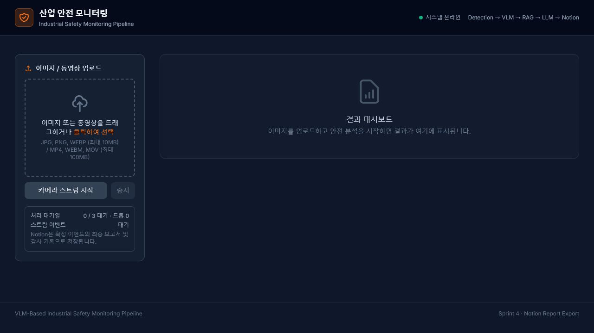
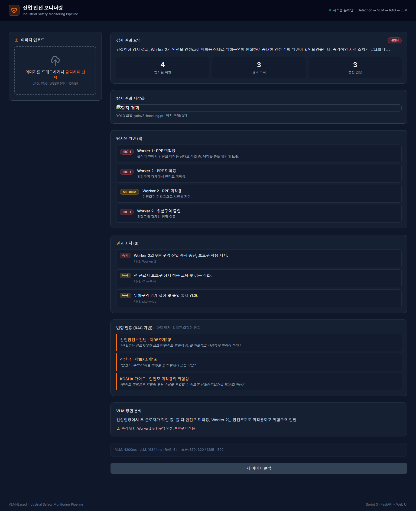
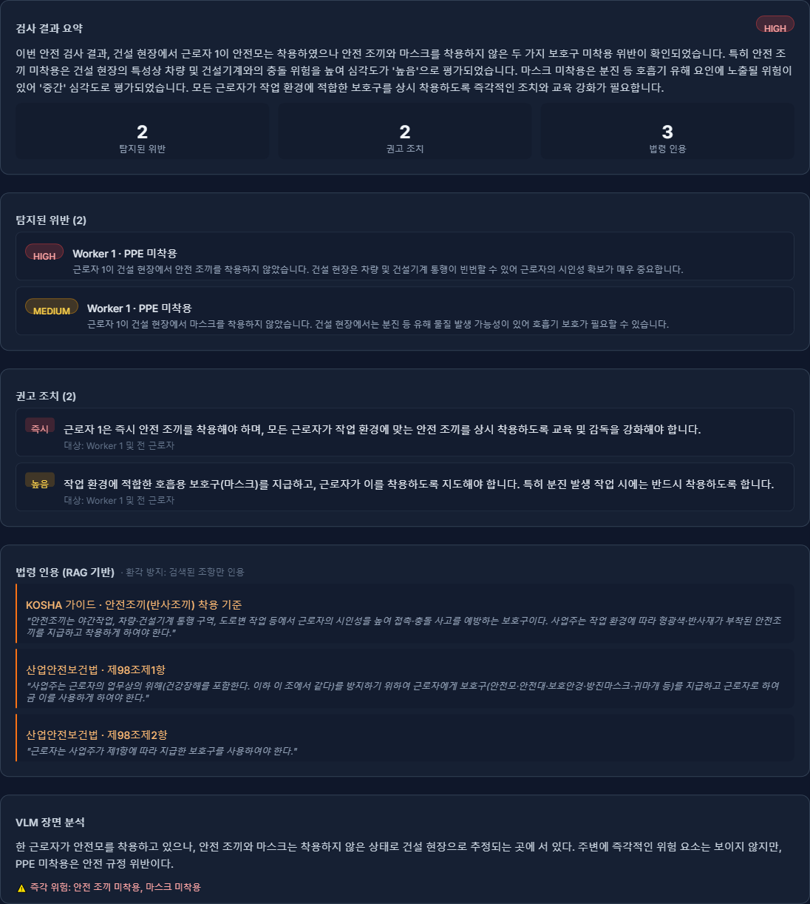
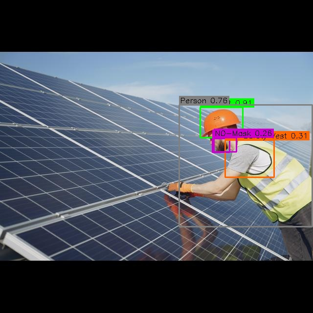
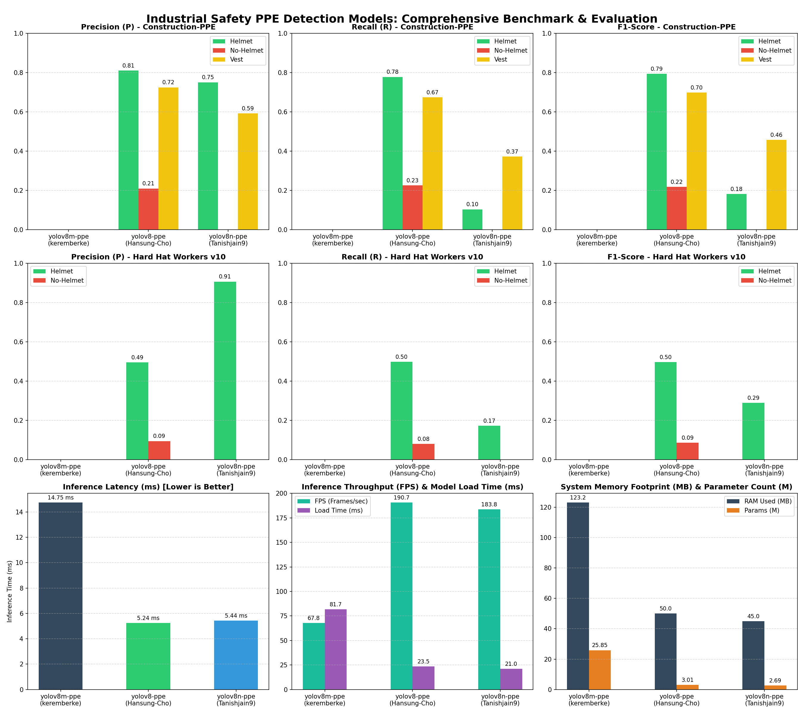

# Industrial Safety Monitoring Pipeline

> Portfolio-scale safety inspection system: local PPE detection, VLM scene analysis, grounded regulation retrieval, and structured incident reporting.

[](#run-locally)
[](#api-contract)
[](https://fuzzy-wildebeest-406.notion.site/VLM-Safety-Monitor-38d73d4932e0807e9e35df13c2611834?source=copy_link)

## What It Does

```text
media input -> YOLO PPE detection -> VLM scene analysis -> RAG regulation retrieval -> LLM report -> Notion archive
```

- Accepts images, videos, and browser-camera frames.
- Detects people and PPE locally, then sends only ambiguous or violation-like events to Gemini VLM.
- Represents uncertainty through `unknown`, visibility, occlusion, and analysis-limitations fields.
- Retrieves Korean safety regulations with typed canonical RAG queries, then produces a structured report with grounded citations.
- Archives the captured source image and rendered UI report in Notion.
- Uses two-frame confirmation, cooldown, bounded queueing, and in-memory video processing for streaming input.

## Product Evidence

### Live Operations Console



### Inspection Dashboard

The dashboard brings severity, violations, recommended actions, regulation citations, and VLM scene analysis into one operational view.



### Captured Report And Detection Evidence

The rendered report is captured for the Notion audit record. The annotated source image remains linked to the structured result.

| Rendered report capture | YOLO detection evidence |
| --- | --- |
|  |  |

## Architecture

| Layer | Responsibility | Guardrail |
| --- | --- | --- |
| YOLO | Boxes, classes, confidence | Low-F1 violation classes trigger review rather than final truth. |
| VLM | Scene context and worker PPE state | Uses `unknown` for occlusion, low light, glare, or detector/image conflict. |
| RAG | Regulation retrieval | Canonical typed queries, similarity threshold, required-term gate, parent-child chunks. |
| LLM | Report, severity, actions, citations | Cites only retrieved clauses; pipeline controls report date. |
| FastAPI | Upload, queue, status, results | Typed public output filters paths, tracebacks, raw RAG text, and internal IDs. |
| Notion | Inspection archive | Stores source-image and UI-report captures per job. |

## Evaluation Snapshot

Deployed detector: `Hansung-Cho/yolov8-ppe-detection`, evaluated at confidence `0.25` and IoU `0.50` on every currently available labeled test image.

| Dataset | Test images | Helmet F1 | No-helmet F1 | Vest F1 |
| --- | ---: | ---: | ---: | ---: |
| Construction-PPE | 141 | 0.793 | 0.217 | 0.698 |
| Hard Hat Workers v10 | 706 | 0.496 | 0.086 | N/A |

The low no-helmet F1 is why violation-like detector findings enter the VLM review path instead of becoming unqualified final findings. The available data is PPE/construction focused; this is **not** a claim of logistics-site or general industrial-domain coverage.



### End-To-End Latency

Measured on `Construction-PPE/image1.jpeg` with the full VLM/RAG/LLM path:

| Stage | Cold run | Warm run |
| --- | ---: | ---: |
| YOLO inference | 19.0 ms | 24.2 ms |
| VLM API | 14.69 s | 14.91 s |
| RAG | 26.44 s | 34.8 ms |
| LLM API | 19.32 s | 18.10 s |
| Total | 60.47 s | 33.07 s |

YOLO weights and the RAG embedder/vector store are process-cached. After warm-up, external VLM/LLM calls are the dominant latency. VLM and LLM are intentionally not parallelized: the report must consume VLM evidence and the RAG clauses derived from it.

Reproduce the evidence:

```bash
python -m detection.experiments.final_dataset_evaluation
python -m detection.experiments.pipeline_benchmark datasets/construction-ppe/images/test/image1.jpeg --warm-runs 3 --pipeline-runs 2
```

Versioned experiment outputs: [dataset evaluation](assets/portfolio/final_dataset_evaluation.json) and [pipeline latency benchmark](assets/portfolio/pipeline_latency_benchmark.json).

## Run Locally

```bash
git clone <your-repository-url>
cd Industrial_Safety_Monitoring_Pipeline
python -m venv .venv
.venv\Scripts\activate
pip install -r requirements.txt
copy .env.example .env
uvicorn api.main:app --reload
```

Open `http://127.0.0.1:8000` for the operations console and `http://127.0.0.1:8000/docs` for the OpenAPI contract.

Required `.env` values:

```env
GEMINI_API_KEY=your_gemini_api_key
GEMINI_API_KEY2=optional_fallback_key
NOTION_API_KEY=your_notion_api_key
NOTION_REPORT_PARENT_PAGE_ID=your_notion_parent_page_id
NOTION_AUTO_EXPORT=1
```

Set `NOTION_AUTO_EXPORT=0` to run without creating a Notion page.

## API Contract

| Endpoint | Purpose |
| --- | --- |
| `POST /upload` | Upload an image or video and receive a queue-backed job id. |
| `POST /stream/frame/{stream_id}` | Submit one browser-camera frame; only confirmed events enter the full pipeline. |
| `GET /status/{job_id}` | Read public progress without internal paths or tracebacks. |
| `GET /results/{job_id}` | Receive validated Detection, VLM, RAG, LLM, report, Notion, and timing fields. |
| `GET /health` | Inspect queue capacity and drop/reject counters. |

`/results` is an allow-listed Pydantic response. Raw RAG chunks, local paths, tracebacks, provider details, and Notion internal IDs do not leave the API boundary.

## Repository Layout

```text
api/                    FastAPI app and public response schemas
detection/              YOLO detector, stream/video policy, evaluations
vlm/                    VLM prompt variants and structured scene schema
rag/                    Canonical query builder, parent-child RAG, incremental indexing
llm/                    Structured safety-report generator
notion/                 Report export, Devlog, and Sprint progress tools
frontend/               Single-page operations console
tests/                  Contract, stream, queue, RAG, VLM, and LLM regression tests
assets/portfolio/       Versioned UI, report, and detection evidence used above
```

## Validation

```bash
python -m unittest discover -s tests -p "test_*.py" -v
```

Latest final regression suite: `22/22` passing. It covers API response filtering, prompt contracts, VLM confidence/occlusion behavior, RAG gates and incremental indexing, queue bounds, and stream confirmation.

## Known Limits And Next Work

- No new logistics, manufacturing, or site-specific held-out data has been collected. Domain-generalization claims are deferred.
- VLM/LLM quality depends on external provider availability and rate limits. Startup warm-up and provider-specific backoff metrics are the next operations work.
- Occlusion and lighting use deterministic synthetic transformations; real field-condition evaluation needs separately collected, labeled footage.
- YOLO is not retrained in this scope. Weak detector classes are routed to review and explicitly documented.

## License

MIT
